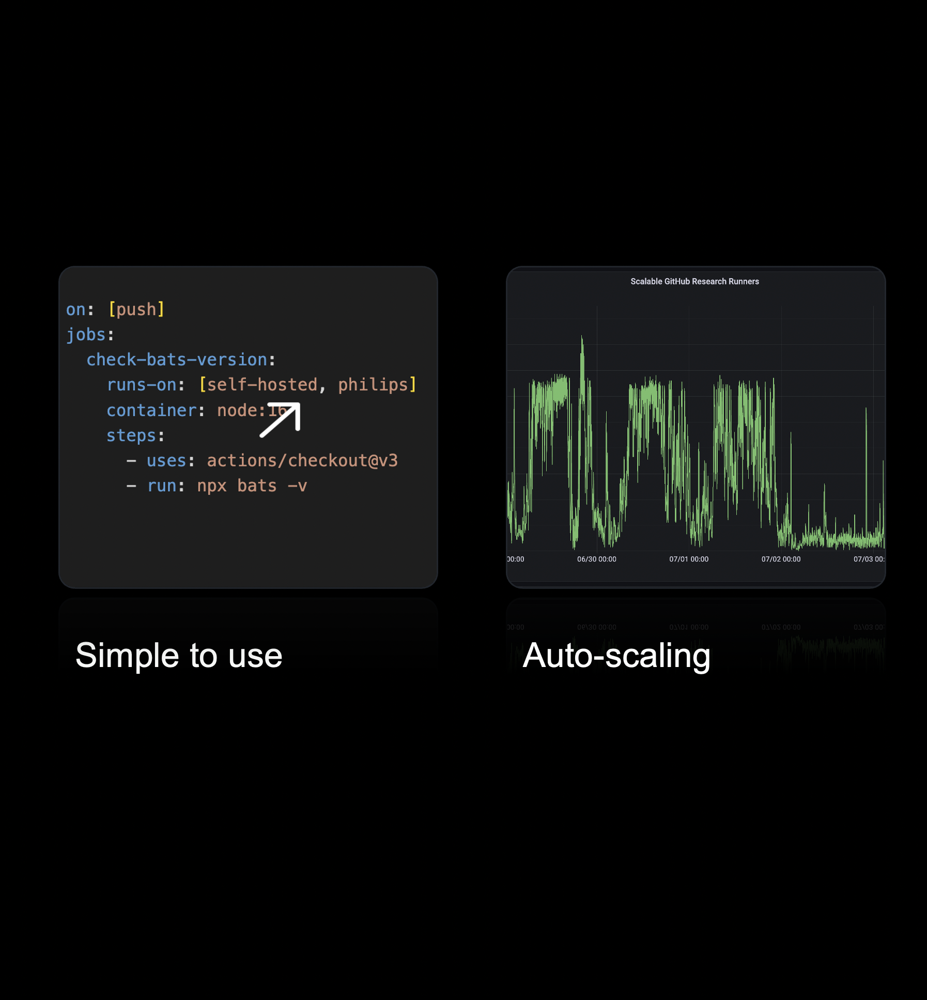
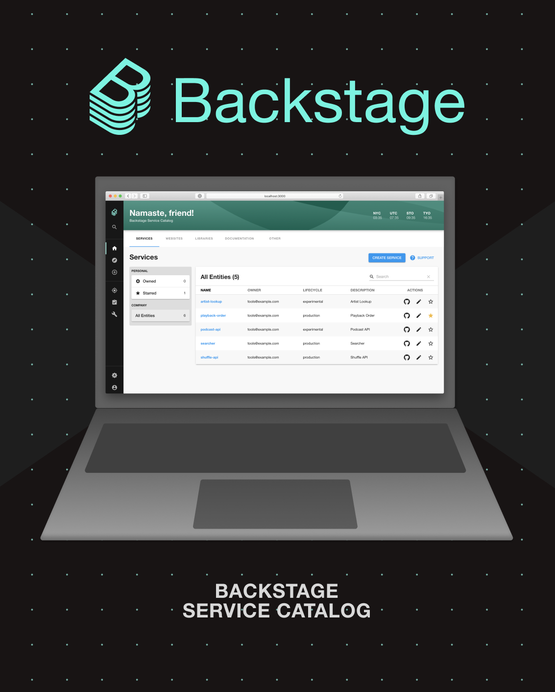
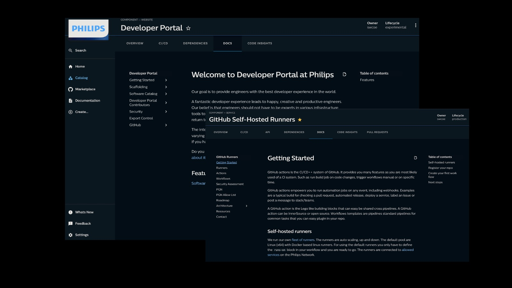
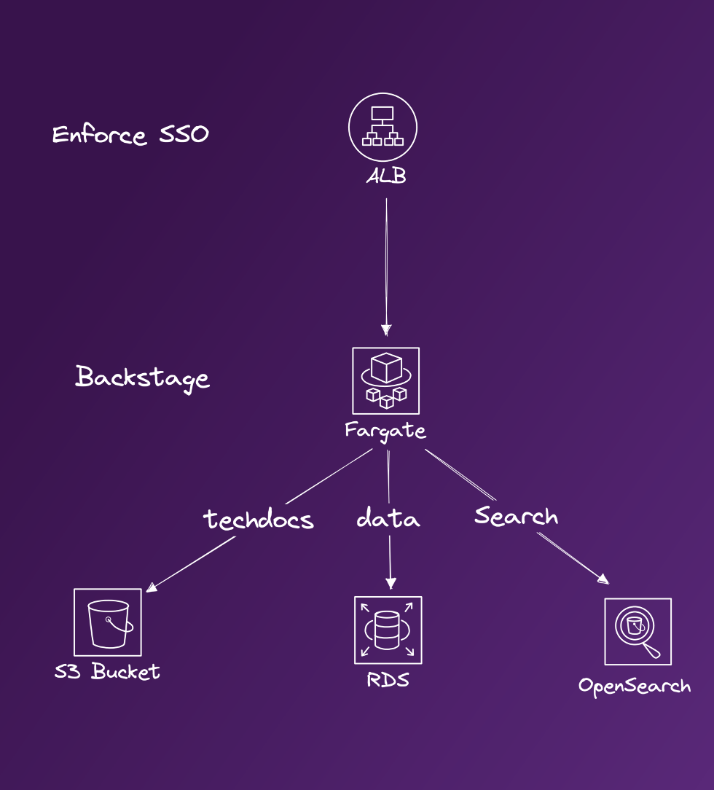

<!--
_backgroundColor: #FFC0CB
_color: #00008B
-->

<style scoped>
h1 {
  text-align: right;
  font-size: 80px;
  color: #00008B;
}

h2 {
  font-size: 60;
  text-align: right;
}

em {
  font-weight: bold;
  font-style: normal;
  color: red;
}

p {
  font-style: italic;
  text-align: right;
}

strong {
    font-weight: bold;
    color: green;
}
</style>


# From *Friction* to **Flow**

Enabling Collaboration and 
Developer Experience at Scale

<br>
<br>

## Niek Palm


---


<!--
_backgroundColor: #002C77
_color: white
-->

# How do you picture Philips?


<!--
What are we doing here?
Philips is a worldwide recognisable brand almost everyone in the world has heard of Philips.
But you don't think of software.
How do you picture philips?
-->

---
<!--
_backgroundColor: #00629F
_color: white
-->


# Probably this?

---

# <!-- fit --> Not this


<!--
_backgroundColor: #0072DA
_color: white
-->


---

<!--
_backgroundColor: #0072DA
_color: white
-->

## Philips is a **health technology** company improving people's health and well-being through meaningful innovation

## Our purpose is to improve people’s health and well-being. We aim to improve 2.5 billion lives per year by 2030


---

<!--
_backgroundColor: #0072DA
_color: white
-->

# Software in Philips

- 8000+ software professionals

- Global organisation

- Regulated medical software

- 100s millions lines of code


<!-- 
We build a lot of software in philips
We have a lot of different business units that historically have little alignment
 -->


--- 
<!--
_backgroundColor: red
_color: yellow
-->


# Challenges

- Hard to start
- Hard to collaborate
- Hard to unlock new features
- Hard to automate common tasks

---

<!--
_backgroundColor: #D10077
_color: #EABEDB
-->

# Adopting InnerSource

- Collaborate at Scale 

- Build on top of GitHub (SaaS)


<!-- 

InnerSource is key to our software strategy

In Philips we combine world class tools to enable teams to focus on meaningful innovation to improve people lives.

InnerSource is a development methodology where engineers build proprietary software using best practices from large-scale open source projects.
 -->


---


<!--
_backgroundColor: #D10077
_color: #EABEDB
-->

# Enable InnerSource

- One source code platform

- InnerSource as default

- Control by the owning team

<!-- 

NOTES 

-->

---


<!--
_backgroundColor: #D10077
_color: #EABEDB
-->

# Source needs CI/CD

- First class citizen

- As easy as for Open Source

- But with entrpise needs

<!-- 

NOTES 

-->

---

<!--
_backgroundColor: #D10077
_color: #93C2F8
-->

# Enable CI/CD 
with GitHub Actions

```yaml
on: [push]
jobs:
  check-bats-version:
    runs-on: [ubuntu-latest]
    container: node:16
    steps:
      - uses: actions/checkout@v3
      - run: npx bats -v
```


---

<!--
_backgroundColor: #269A91
_color: #244C5D
-->

## <!-- fit --> But how can we connect
## <!-- fit --> to our network?


---


<!--
_backgroundColor: #269A91
_color: #244C5D
-->

## <!-- fit --> ~~hosted runners~~
## <!-- fit --> self-hosted runners


---
<!--
_backgroundColor: #269A91
_color: #244C5D
-->

## <!-- fit --> Why self-hosted?


---

<!--
_backgroundColor: #000000
_color: #93C2F8
-->


# <!-- fit --> How to bring same DevX to self-hosted runners? 


---

<!--
_backgroundColor: #D10077
_color: #93C2F8
-->

<!--
_backgroundColor: #008540
_color: #144835
-->

# <!-- fit --> Manual?


<!-- 

- Scale?

- Sustainable?

- Maintenance?

-->


---

<!--
_backgroundColor: #D10077
_color: #93C2F8
-->

<!--
_backgroundColor: #008540
_color: #144835
-->

# <!-- fit --> Ask AI?


<!-- 


-->


---
<!--
_backgroundColor: #D10077
_color: #6D1E4A
-->

<style scoped>
h2 {
  text-align: center;
  font-size: 75px;
  color:  #FABCDB;
}
</style>

# <!-- fit --> Event based

## Scale based on workflow jobs


---

<!--
_backgroundColor: #008540
_color: #144835
-->

<style scoped>
h2 {
  text-align: center;
  font-size: 62px;
  color: #A0DABB;
}
</style>

# <!-- fit --> Serverless

## low cost / low maintenance control plane


---

<!--
_backgroundColor: #269A91
_color: #244C5D
-->

<style scoped>
h2 {
  text-align: center;
  font-size: 75px;
  color: #7EDDDE;
}
</style>

# <!-- fit --> Treat as Cattle

## Secure and no fire fighting


---

<!--
_backgroundColor: #DE7C00
_color: #9B3426
-->

<style scoped>
h2 {
  text-align: center;
  font-size: 75px;
  color: #FDD37A;
}
</style>

# <!-- fit --> Networking

## Bring your own connection

<!-- 
Connectivity is abstract of the end solution. You bring the solution to your network and take advantage of it 
-->
---

<!--
_backgroundColor: #000000
_color: #93C2F8
-->

# <!-- fit --> 💡 Event based / serverless / cattle / byon 💡


---

<!--
_backgroundColor: #269A91
_color: #244C5D
-->

<style scoped>
section {
  font-size: 28px;
}
</style>

# Scalable self-hosted

**Serverless** contol plane handling events from GitHub to scale self-hosted (ephemeral) Linux / Windows runners on **AWS EC2 (Spot) Instances**

**Terraform module** with out of the box working configuration which can be tailored to  specific use-cases.


<!--  
* GitHub App for events
* AWS API gateway to get events
* AWS Lambda for event handling
* AWS SQS for decoupling
* AWS Lambda to scale up
* GitHub App for API access
* AWS EC2 (Spot) to run jobs
* AWS Direct connect for networking
* AWS Lambda for scaling down -->


---

# <!-- fit --> 📢 DEMO


---


---
<!--
_backgroundColor: #269A91
_color: #244C5D
-->

# Open Source

✨ ARM | Windows | GHES | Security

⭐ ThoughtWorks Radar Tools Assess

🏆 Recommended by GitHub


<!-- 

topics we could cover

- PR checks automated
- Automated release
- Slack
- Build a community

# Contribution

- Support windows
- Support ARM
- Support GHES
- Better docs
- Security improvements
- Upgrades

 -->

---

<!--
_backgroundColor: #DE7C00
_color: #9B3426
-->

# <!-- fit --> Running at Scale

# <!-- fit --> in Philips


---


<!--
_backgroundColor: #DE7C00
_color: #9B3426
-->

# <!-- fit --> Running at Scale

# <!-- fit --> in Philips





---


<!--
_backgroundColor: #191a1a
_color: #ffffff
-->

<style scoped>
section {
  font-size: 45px;
}
</style>

🧑‍💻 4K+ developers

🗃️ 8K+ repositories

🚀 30K+ jobs / day


---

# Lessons learned


---


<!--
_backgroundColor:  #002C77
_color: #93C2F8
-->

# <!-- fit --> 🚀💨 
# <!-- fit --> speed


<!--
* Caching GitHub runner binary
* Pre-build AMI
* Utilize Insance store
-->

---

#  🚫 Limits 🚫


---


<!--
_backgroundColor:  red
_color: yellow
-->

# <!-- fit --> 🔥 🔥 🔥 🔥 🔥


---


<!--
_backgroundColor: #110d0d
_color: #0072DA
-->

# <!-- fit --> 🚀 Developer Experience 🚀


* How do we onboard members?
* How to bootstrap a repository?
* How can we automate tasks?
* How do find our software assets?
* How to make documentation easy?


---


<!--
_backgroundColor: #110d0d
_color: #0072DA
-->

# <!-- fit --> Developer Portal

> Build an ecosystem, not a wilderness

- Software Catalogus
- Bootstrap / Scaffolding
- TechDocs





---

<!--
_backgroundColor: #000000
_color: #0072DA
-->

# 📙 Software Catalogus


---

<!--
_backgroundColor: #000000
_color: #0072DA
-->

# ⛭ Scaffolding / Automation


---

<!--
_backgroundColor: #000000
_color: #0072DA
-->

# 📚 TechDocs




---

<!--
_backgroundColor: #000000
_color: #0072DA
-->

# 🚀 Enable via configuration

- Define software assets as code (catalog file)
- Enable plugins via annotation
- Default integrations enabled
- No extra development efforts required


---

<!--
_backgroundColor: #000000
_color: #0072DA
-->

# ✨ Contribution

- Open for extension via InnerSource
- Developer guide for extension
- Enable via DevContainers / CodeSpaces


---

<!--
_backgroundColor: white
_color: #0072DA
-->



# <!-- fit --> :rocket: also serverless

- ALB to enforce SSO login
- Fargate to serve Backstage 
- OpenSearch to speed up searches
- S3 to serve TechDocs


---

<!--
_backgroundColor: #D10077
_color: #EABEDB
-->

# Compliance

* Assist to do it right - scaffolding
* Avoid shadow IT - e.g. runners
* Continuous compliance - rule based
* Guide - welcome issue new members


---


<!--
_backgroundColor: #D10077
_color: #EABEDB
-->

# Data pipe

<br>
<br>
<br>
<br>
<br>
<br>
<br>
<br>
<br>
<br>
<br>
<br>


---
<!--
_backgroundColor: black
-->

```hcl
# Resources

resource "website" "github_runners" {
  url = "github.com/philips-labs/terraform-aws-github-runner"
}

resource "website" "github_oidc" {
  url = "github.com/philips-labs/terraform-aws-github-oidc"
}

resource "website" "slides" {
  url = "https://npalm.github.io/2023-10-06-devopsdays-madrid"
}

resource "contact" "niek" {
  github   = "@npalm"
  linkedin = "in/niekpalm/"
  twitter  = "@niekos77"
}


```


---
# Questions

<style scoped>
h1 {
  font-size: 120px;
}
</style>


---


<!--
_backgroundColor: #D10077
_color: purple
-->

# <!-- fit --> Thank You
<br>
<br>
<br>


